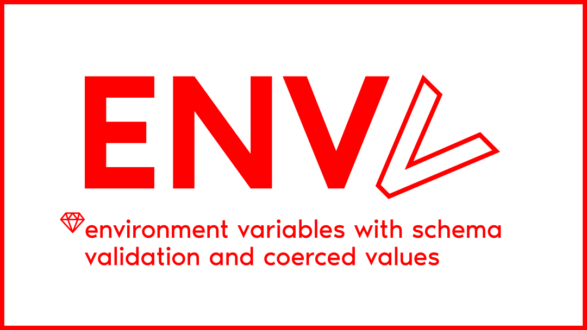

# ENVV

ENVV provides a ENV like accessor with schema validation and coerced values. 

* By providing an explicit schema of required environments variables, it will facilitate collaborative development and deployment.
* It will inform you during the boot process of your application if you miss to provide some valid environment variables, avoiding bugs during execution.
* Schema and coercition are handled by [dry-rb](https://dry-rb.org/) libraries, with the benefits of the powerful DSL of [Dry::Schema](https://dry-rb.org/gems/dry-schema), its built-in [predicates](https://dry-rb.org/gems/dry-schema/1.13/basics/built-in-predicates/) and [types](https://dry-rb.org/gems/dry-schema/1.13/basics/type-specs/).


## Installation

Install the gem and add to the application's Gemfile by executing:

    $ bundle add envv

If bundler is not being used to manage dependencies, install the gem by executing:

    $ gem install envv

**Requirements**: this library officially supports the following Ruby versions

* MRI `>= 3.0.0`


## Usage

Build your ENVV with [Dry::Schema.Params](https://dry-rb.org/gems/dry-schema/1.13/params/) rules to describe your env vars requirements.

```ruby
ENVV.build! do
  required(:MY_STRING_VAR).filled(:string)
  required(:MY_INT_VAR).filled(:integer, gt?: 3000)
  required(:MY_BOOLEAN_VAR).filled(:bool)
end
```

If requirements are not satisfied, it will **raise an exception**. So be sure this validation occurs as soon as possible in the boot process of your application.
In a Ruby On Rails application, you can place it in an initializer and ensure it will be executed first by naming it `app/initializers/01-envv.rb` for example, since initializers are run in alphabetical order.

If environment variables are validated, you can now access their coerced value with `ENVV#fetch` method:

```ruby
# With ENV
#
# MY_STRING_VAR=hello
# MY_INT_VAR=4000
# MY_BOOLEAN_VAR=True

ENVV.fetch("MY_STRING_VAR") # ⇒ "Hello"
ENVV.fetch("MY_INT_VAR") # ⇒ 4000
ENVV.fetch("MY_BOOLEAN_VAR") # ⇒ true
```


## Development

After checking out the repo, run `bin/setup` to install dependencies. Then, run `rake test` to run the tests. You can also run `bin/console` for an interactive prompt that will allow you to experiment.

To install this gem onto your local machine, run `bundle exec rake install`. To release a new version, update the version number in `version.rb`, and then run `bundle exec rake release`, which will create a git tag for the version, push git commits and the created tag, and push the `.gem` file to [rubygems.org](https://rubygems.org).


## Contributing

Bug reports and pull requests are welcome on GitHub at https://github.com/16/envv. This project is intended to be a safe, welcoming space for collaboration, and contributors are expected to adhere to the [code of conduct](https://github.com/16/envv/blob/master/CODE_OF_CONDUCT.md).


## License

The gem is available as open source under the terms of the [MIT License](https://opensource.org/licenses/MIT). See the separate [LICENSE.txt](LICENSE.txt) file. © Copyright 2023 Fabrice Luraine aka asciilander with spacedotspace collective.

